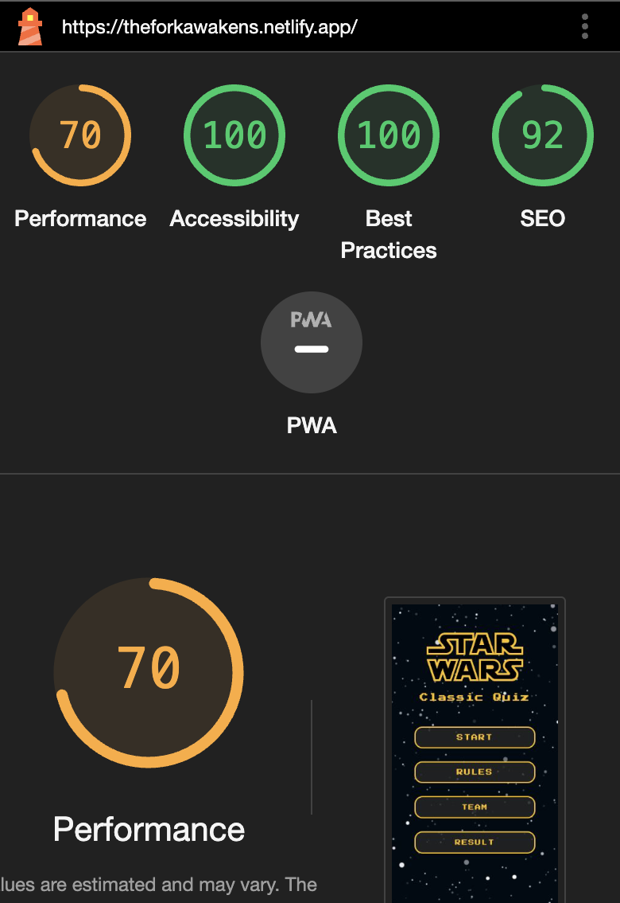

# **Classic Stars Wars Testing Documentation**

## **Table of contents**

- [**HTML Validation**](#html-validation)
- [**CSS Validation**](#css-validation)
- [**JavaScript Validation**](#javascript-validation)
- [**Lighthouse**](#lighthouse)
- [**Manual Testing**](#manual-testing)
- [**Final Review**](#final-review)

## **HTML Validation**

All HTML code has been run through the [W3C - HTML](https://validator.w3.org/) validator. The only errors appear to be confusion over the use of Django.

## **CSS Validation**

All CSS code has been run through the [W3C - CSS](https://jigsaw.w3.org/css-validator/) validator. There was a minor error with text-wrap in style.css, although it does function as intended.

## **JavaScript Validation**

We will use browser developer tools to fix console errors, detect memory leaks, and verify key functions like the "score counter." Additionally, manual testing will check functionality, user scenarios, and cross-browser performance to ensure reliability.

## **Lighthouse**

- The lighthouse score results can be found below.

## **Manual Testing**

Contrast checks were carried out. Errors were found, but the checker appears to get confused about which background the text is being checked against.

  <table>
  <tr>
    <th>Features</th>
    <th>Bugs/Issues</th>
  </tr>
  <tr>
    <td>LINKS: Start button</td>
    <td>Not Detected</td>
  </tr>
   <tr>
    <td>LINKS: Rules Button</td>
    <td>Not Detected</td>
  </tr>
   <tr>
    <td>LINKS: Teams button</td>
    <td>Not Detected</td>
  </tr>
   <tr>
    <td>LINKS: Git Hub button</td>
    <td>Not Detected</td>
  </tr>
 <tr>
    <td>LINKS: LinkedIn button</td>
    <td>Not Detected</td>
  </tr>
   <tr>
    <td>LINKS: Repository button</td>
    <td>Not Detected</td>
  </tr>
   <tr>
    <td>LINKS: Return Home button</td>
    <td>Not Detected</td>
  </tr>
  </tr>
   <tr>
    <td>LINKS: StarWars Home button</td>
    <td>Not Detected</td>
  </tr>
   <tr>
    <td>LINKS: Results button</td>
    <td>Not Detected</td>
  </tr>
   <tr>
    <td>LINKS: Quiz 1 Results button</td>
    <td>Not Detected</td>
  </tr>
   <tr>
    <td>LINKS: Quiz 2 Results button</td>
    <td>Not Detected</td>
  </tr>
   <tr>
    <td>LINKS: Quiz 3 Results Button</td>
    <td>Not Detected</td>
  </tr>
  <tr>
    <td>LINKS: start Button </td>
    <td>Not Detected</td>
  </tr>
   <tr>
    <td>LINKS: start Button </td>
    <td>Not Detected</td>
  </tr>

  </table>
   
<table>
  <tr>
    <th>Quiz</th>
    <th>Bugs/Issues</th>
  </tr>
  <tr>
    <td>Red color if the answer was incorrect </td>
    <td>Not Detected</td>
  </tr>
   <tr>
    <td>Green color if the answer was correct</td>
    <td>Not Detected</td>
  </tr>
   <tr>
    <td>when selection an an option while hoovering the backgrounds changes to yellow </td>
    <td>Not Detected</td>
  </tr>
   <tr>
    <td>with every wrong answer the wrong score turns red and adds a number to it </td>
    <td>Not Detected</td>
  </tr>
 <tr>
    <td>with every right answer the right score turns green and adds a number to it</td>
    <td>Not Detected</td>
  </tr>
   <tr>
    <td>Sounds effect when starting the game</td>
    <td>Not Detected</td>
  </tr>
   <tr>
    <td>Button for silencing the sound effects </td>
    <td>Not Detected</td>
  </tr>
  </tr>
   <tr>
    <td>Game Over card appearing at the end of the game</td>
    <td>Not Detected</td>
  </tr>
   <tr>
    <td>Game Over final results</td>
    <td>Not Detected</td>
  </tr>
   <tr>
    <td>Enter name input text field</td>
    <td>Not Detected</td>
  </tr>
   <tr>
    <td>Save button</td>
    <td>Not Detected</td>
  </tr>
   <tr>
    <td>Home Button</td>
    <td>Not Detected</td>
  </tr>
  </table>

## **Final Review**

The testing procedures have been executed, meeting all specified criteria. Results have been thoroughly documented, and any identified issues have been addressed. Post-testing, the website has been confirmed to be fully functional and accessible.
